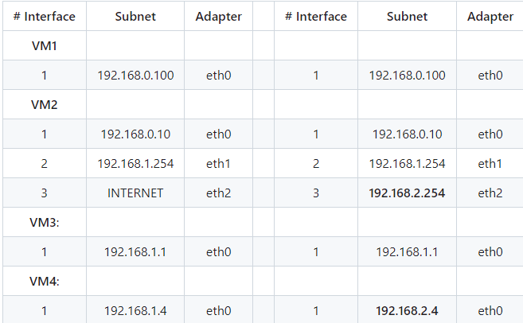
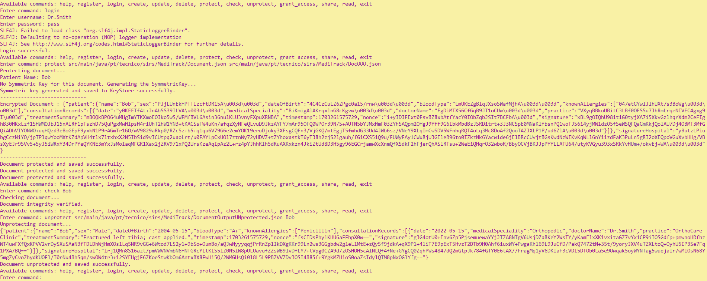

# A17 MediTrack Project Read Me


## Team

| Number | Name              | User                             | E-mail                              |
| -------|-------------------|----------------------------------| ------------------------------------|
| 99196  | David Matos       | https://github.com/Dmatos16      | davidmfsgmatos@tecnico.ulisboa.pt      |
| 110828 | Eduardo Carvalho  | https://github.com/eduC21        | eduardo.d.carvalho@tecnico.ulisboa.pt  |
| 99308  | Rafael Alves      | https://github.com/rafaelsalves15| rafael.santos.alves@tecnico.ulisboa.pt |

 


## Contents

This repository contains documentation and source code for the *Network and Computer Security (SIRS)* project.

The [REPORT](REPORT.md) document provides a detailed overview of the key technical decisions and various components of the implemented project.
It offers insights into the rationale behind these choices, the project's architecture, and the impact of these decisions on the overall functionality and performance of the system.

This document presents installation and demonstration instructions.


## Installation

To see the project in action, it is necessary to setup a virtual environment, with 3 networks and 4 machines.  

The following diagram shows the networks and machines:

The virtual environment used in this project is equal to the Virtual Networking lab.



### Prerequisites

All the virtual machines are based on: Linux 64-bit, Kali 2023.3  

[Download]([https://...link_to_download_installation_media](https://www.virtualbox.org/wiki/Downloads)) and [install][(https://...link_to_installation_instructions](https://www.kali.org/)) a virtual machine of Kali Linux 2023.3.  
Clone the base machine to create the other machines.


### Machine configurations

$ git clone https://github.com/tecnico-sec/a17-eduardo-david-rafael.git

#### Machine 1

This machine runs the client 

This machine uses an SSH connection to the Hospital Server machine.

To verify:

$ ssh-keygen -t rsa -b 2048 -f ~/.ssh/sirs
$ ssh-copy-id -i ~/.ssh/sirs kali@192.168.1.1
$ ssh kali@192.168.1.1 -p 22 -i ~/.ssh/sirs 

To run the source code:

$cd repo_folder

$mvn clean install compile

$mvn exec:java -Dexec.mainClass=pt.tecnico.sirs.MediTrack.CommandLineInterface 

The expected results are an SSH tunnel connection with Hospital Server machine (ip: 192.168.1.1) 

#### Machine 2

This machine has the firewall rules.
We used ufw for this setup.

The firewall rules used are the following:

$sudo apt-get update && sudo apt-get upgrade

$sudo apt install ufw

$sudo ufw allow from VM1_IP to VM3_IP port 22 (SSH_PORT)

$sudo ufw allow from VM3_IP to VM1_IP port 22 (SSH_PORT)

$sudo ufw allow from VM3_IP to VM4_IP port 3306 (DATABASE_PORT)

$sudo ufw allow from VM4_IP to VM3_IP port 3306 (DATABASE_PORT)

$sudo ufw default deny incoming

$sudo ufw default allow outgoing

%sudo ufw enable

#### Machine 3

This machine runs the Hospital Server

This machine will have the source code.

$sudo service ssh start (So the client can access this machine)

#### Machine 4

This machine runs the Hospital DataBase Server. 
The DataBase used is MariaDB.

mysql -u root -p
CREATE DATABASE Meditrack;
CREATE USER 'new_user'@'%' IDENTIFIED BY 'new_password';
GRANT ALL PRIVILEGES ON Meditrack.* TO 'new_user'@'%';

- Run the CreateDB.sql and PopulateDB.sql code in the MariaDB terminal
  
$source CreateDB.sql
$source PopulateDB

## Demonstration

Now that all the networks and machines are up and running, ...

```
protect <input-file> <output-file>

```

```
check <patient-name>

```

```
unprotect <output-file> <patient-name>

```



This concludes the demonstration.

## Additional Information

### Links to Used Tools and Libraries

- [Java 11.0.16.1](https://openjdk.java.net/)
- [Maven 3.9.5](https://maven.apache.org/)
- ...

### Versioning

We use [SemVer](http://semver.org/) for versioning.  

### License

This project is licensed under the MIT License - see the [LICENSE.txt](LICENSE.txt) for details.

*(switch to another license, or no license, as you see fit)*

----
END OF README
