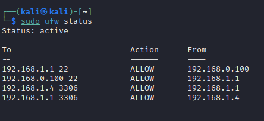

# A17  MediTrack Project Report

## 1. Introduction

In response to the evolving needs of healthcare institutions our team is proud to announce the development of our new application named Meditrack!
MediTrack is an Electronic Health Records (EHR) system designed specifically to satisfy the requirements of healthcare facilities in Portugal by offering a secure platform for managing patient data across a range of medical services. 

Patient information is securely stored in a structured document format, guaranteeing the preservation of data integrity, authenticity and confidentiality.This secure document encompasses essential patient details, including personal information, medical history, and a chronological record of consultations across different medical specialties.

To fortify security measures, both the server and the database are shielded by a firewall. This firewall serves as a protective barrier, ensuring the security of our system against potential unauthorized access and external threats. This layered approach is integral to maintaining the integrity and confidentiality of patient data within the Meditrack system.

Here we have a representation of our Application Architeture: 

## 2. Project Development

### 2.1. Secure Document Format

#### 2.1.1. Design

The significance of securing patient information within the healthcare landscape cannot be overstated. As custodians of sensitive data, healthcare institutions bear the responsibility of ensuring the utmost confidentiality, integrity, and authenticity of patient records.
The operations facilitated by the cryptographic library—protect serve as the backbone of Meditrack's security framework. These operations are not mere technical functionalities, they represent a robust set of measures designed to safeguard patient information.

The opperations implemented in MediTtrack are the following:
##### Register:
This operation registers a new user in the database by prompting the user to input a username and a password.

##### Login:
This operation facilitates the login of a registered user. Most primary operations within this application can only be executed by a user who has successfully logged in.

##### Protect: 
Ensures confidentiality, integrity, authenticity, and freshness.
 
This operation secures the patient document through cryptographic methods, it only encrypts JSON values leaving the headers unencrypted. Regarding the patient information, it encrypts all of their information except for the name allowing for queries to search for a specific patient.

This operation encrypts all records, but it specifically receives only one doctor's name and signs only their associated record. This implementation was designed with consideration for real-life scenarios where document records accumulate over time. The protection is applied as each new record is added, ensuring that the document remains safeguarded throughout its evolution.

The protection is implemented in the following manner:
- Firstly, it generates a symmetric key and stores it in the symmetricKeys keystore, with the patient's name serving as the title. The patient's name functions as the document's unique identifier.
- The hospital's private key is then used to sign the original patient document, ensuring its authenticity and integrity. The inclusion of the hospital's signature in the protected document serves the purpose of ensuring that the document remains unaltered. It acts as a safeguard against any modifications such as the deletion/addition of records or patient information tampering.
- Then, we sign the doctor's record with their private key and incorporate a nonce and timestamp to ensure freshness.
- The encryption is performed using the document symmetric key, which is encrypted with both the patient's and doctor's public keys (Hybrid Cypher), ensuring that both entities can decrypt the document. 
- Finally, we store the document and the encrypted symmetric key in the dataBase. We store two protected documents (protected_document_Patient and protected_document_Doctor). One instance corresponds to when the symmetric key was encrypted with the doctor's public key, and the other instance reflects the encryption with the patient's public key. This dual storage ensures that both the doctor and the patient can independently access and decrypt the document as needed.
 
All signatures are made with "SHA256withRSA" algorithm because it provides a strong level of cryptographic security.
The encrypton is made with "AES/ECB/PKCS5Padding" because it provides a balance between good security and simplicity.This choice is particularly suitable for our scenario since we are not dealing with large sets of data.

##### Unprotect:
This operation is designed to decrypt a document, making it accessible for patients or doctors to read.

It receives an user name and a patient name.
The patient name is needed because we need to know which document needs to be unprotected and, as highlighted in the Protect operation, we use the patient name as an unique identifier for a specific document. 

- First, we retrieve the document from the database by executing a query based on the patient's name.
- Then we decrypt the encypted symmetric key using the user's (Doctor or patient) private key, depending on who is performing the operation. Any doctor who has previously recorded information for a patient has the capability to unprotect the document at any time, we trust all doctors of the patient.
- After that we decrypt the document with the decrypted symmetric key.
- Afterward, we store the decrypted document on the computer of the individual performing the operation.

The algorithm used for decryption is the same as the one used for encryption.

##### Check:
This operation verifies whether all signatures (from hospitals and doctors) are valid. It achieves this by retrieving the patient document from the database. Subsequently, it iterates through the patient's consultation records, calculates the hash of each record, and employs the respective doctor's public key (associated with the record) to ensure that the document has not been compromised in any way.
 
##### Create:
This operation involves creating a patient document with values provided through the Command Line Interface (CLI) and subsequently saving the generated JSON document in the Hospital Database. In the background, this function triggers the protect operation to ensure the secure storage of the encrypted document in the database.

##### Update:
This operation is designed to add a new record to the document. 
Our team also added the possibility to modify specific patient information. The flexibility to update all patient details, including the name and date of birth, was implemented to account for potential errors in the document creation process in real-life scenarios. Additionally, this operation is crucial as patients may discover new allergies after the creation of their document. 

To execute this operation, we start by retrieving the patient document from the dataBase and we use the Unprotect operation. After that, we update the information based on user input via the Command Line Interface (CLI). Finally, to ensure the secure storage of the updated document in the database, we call the Protect operation.

##### Share:
The user chooses which patient/doctor he wants to show his own file. Additionaly he can select which records he wants to share. 

##### Read:
The user can read the document that was shared with him.

##### Grant_acess:
An user who has access to a medical file can grant access to the record to another user.

##### Help:
Assists the user in the Command Line Interface (CLI) by displaying information about the available operations.

##### Exit:
Exits the program.

##### Notes:
For simplicity reasons our application should not have patients with the same name, because we store the symmetricKey with the patientName to identify the document. Another implementation in our application for simplicity reasons is that the names should not have spaces (ex: use Dr.Smith and not Dr. Smith).

#### 2.1.2. Implementation

Meditrack was developed using Java and built with Maven. The database employed in the application is MariaDB. The main cryptographic libraries used are javax.crypto and java.security.
We initiated the development process by creating the Command Line Interface (CLI), which subsequently triggers specific operations based on the user's input and the desired action. 
Following the establishment of the database, we modified the source code to have the functionality of registered users. We also improved the code so that documents are securely stored in the database, reinforcing the overall security of the system.

In the initial stages, we faced challenges with the structure of JSON files because we wanted it to be always well-structured. After some research (and help from the teacher) we started using the GSON library. This choice helped us maintain precise control over the structure of our documents, aligning them with our desired format.

### 2.2. Infrastructure

#### 2.2.1. Network and Machine Setup

The hospital server accommodates the entire codebase of our project and maintains constant communication with the hospital's database, enabling the storage of encrypted documents and keeping a record of all users created, including both patients and doctors. Both of these structures are protected by a firewall that ensures secure interaction between clients and the hospital server.

#### 2.2.2. Server Communication Security

After encountering difficulties with TLS/SSL, we made the decision to switch and opted for SSH to establish secure communication between the client and server. SSH provides strong encryption, key-based authentication, and effective safeguards against unauthorized access. This decision aligns with our security requirements, guaranteeing a reliable and secure communication environment.

sudo ufw allow from VM1_IP to VM3_IP port 22 (SSH PORT)

sudo ufw allow from VM3_IP to VM1_IP port 22 (SSH PORT)

sudo ufw allow from VM3_IP to VM4_IP port 3306 (DATABASE PORT)

sudo ufw allow from VM4_IP to VM3_IP port 3306 (DATABASE PORT)

sudo ufw default deny incoming

sudo ufw default allow outgoing

sudo ufw enable

Then with the list of commands above we set up the rules of our firewall.

### 2.3. Security Challenge

#### 2.3.1. Challenge Overview

The security challenge prompted us to implement the non-repudiable digital signing of records by physicians, a feature we had already incorporated. Each record is signed with the doctor's private key, ensuring a non-repudiable signature.
We also needed to implement the Share operation which is explained in the 2.1.1 secction.

Regarding the emergency situations the Security Challenge prompted us to contemplate scenarios where a patient might be unable to provide authorization to unprotect their file. Our team had already considered and implemented a solution. In our application, any doctor who has recorded a consultation for the patient has the authorization to unprotect and share the document, we trust every doctor of the patient. While we haven't accounted for extreme cases, such as all relevant doctors being unavailable and the patient being unable to grant authorization, if needed, we could extend the system to grant the hospital director the authority to share and access the patient's document in critical situations.

#### 2.3.2. Attacker Model

In our implementation, both the patient and all doctors who have recorded consultations for that patient are considered trusted entities with access to the patient's document. This trust extends to ensure authorized interactions with the patient's medical records.
Other doctors, who are not designated as the patient's specific physician, do not have authorization to access the patient's medical records. This selective access control ensures the confidentiality and privacy of patient information.

In summary, we trust the patient's designated doctors but do not extend the same level of trust to all doctors.

The attacker is powerfull but our current implementation does not explicitly consider scenarios where a doctor, entrusted with patient information, may act corruptly and exploit the data for unethical purposes. It's an aspect worth further consideration to enhance the robustness of our security measures.
Additionally, we do not account for other extreme cases, such as the theft of a doctor's personal security card leading to unauthorized access to their private keys by an attacker.

#### 2.3.3. Solution Design and Implementation

Most of the security challenge was already thought of as we said before. 
The patient gives access to the doctors to access their document.
In case of an emergency, any previous patient doctor can disclose the patient file. 

## 3. Conclusion

Our team is proud of our work designing a secure document system that ensures confidentiality, integrity, and authenticity.

The Secure Document, Security Challenge and Infrastructure are fully satisfied.
The Secure Connections are partly satisfied due to lack of time.

As mentioned before, the application can still be improved to account for more extreme cases, thereby further enhancing the security it provides.

This project helped us learn more about software security and all the things we have to consider and contemplate. No scenario is simple, each one is very complex in its own way. This project made us realize that we live in a world where cybersecurity is crucial because our information is sensitive and can easily be used for unethical actions.

## 4. Bibliography

https://docs.oracle.com/en/java/javase/11/security/java-security-overview1.html 

----
END OF REPORT
